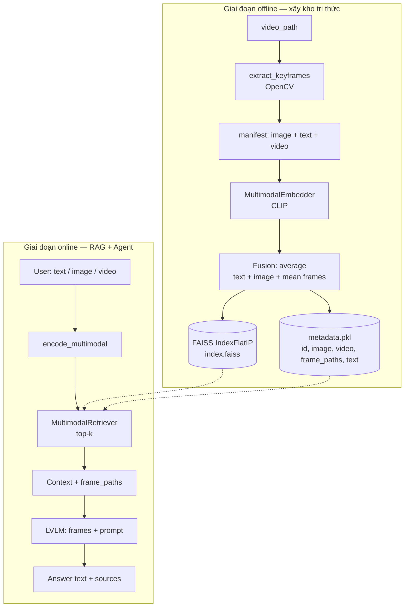
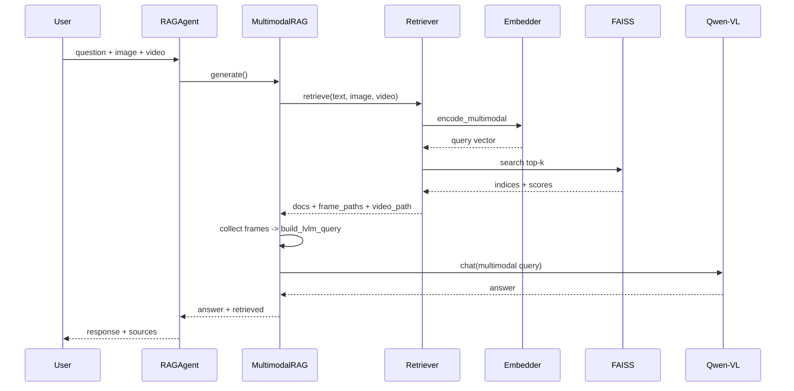
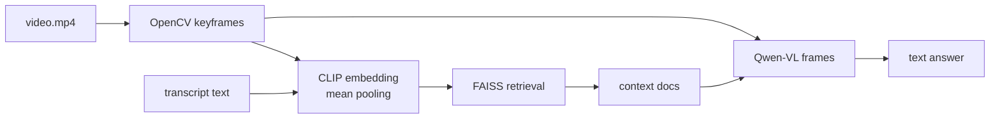

# Multimodal RAG trên LVLM (Qwen-VL)

Hệ thống **RAG đa phương tiện (ảnh + văn bản + video)** trên **LVLM pre-trained** (Qwen-VL-Chat). Video được xử lý qua **keyframe** (OpenCV): embedding CLIP trên chuỗi frame, LVLM nhận frame như ảnh. Truy vấn và corpus đều hỗ trợ **bất kỳ tổ hợp** text / ảnh / video.

---

## Cấu trúc thư mục

```
RAG/
├── config/
│   └── setting.py          # Model names, paths, hyperparameters
├── src/
│   ├── embedder.py         # CLIP: text / image / video(frames)
│   ├── video_utils.py      # Trích keyframe (OpenCV)
│   ├── indexer.py          # FAISS: image + text + video
│   ├── retriever.py        # Truy vấn text / image / video
│   ├── rag.py              # RAG + LVLM (frame = ảnh)
│   ├── agent.py            # Agent: ask / describe_video
│   └── utils.py
├── scripts/
│   ├── train_embedding.py
│   ├── preprocess_videos.py  # Cache frame trước khi index
│   ├── build_index.py
│   └── run_agent.py
├── data/
│   ├── raw/
│   │   ├── manifest.json
│   │   ├── train_pairs.json
│   │   ├── images/
│   │   └── videos/
│   ├── cache/frames/         # Keyframe đã trích
│   └── vector_db/
├── requirements.txt
└── README.md
```

---

## Pipeline chi tiết

### Luồng tổng thể (offline + online)



### Kết hợp đa phương tiện — Input

| Kiểu truy vấn | Embedding | Ghi chú |
|---------------|-----------|---------|
| Chỉ text | `encode_text` | Tìm doc text / ảnh / video+transcript |
| Chỉ ảnh | `encode_image` | Visual search |
| Chỉ video | `encode_video` → mean(frame emb) | Trích `VIDEO_QUERY_FRAMES` frame |
| Text + ảnh + video | `encode_multimodal` fusion `average` | Trung bình mọi modality có mặt |

**Document trong kho** (`media_type`):

| `media_type` | Trường manifest | Vector hóa |
|--------------|-----------------|------------|
| `image` | `image_path`, `text` | CLIP ảnh + text |
| `video` | `video_path`, `text` | mean(frame) + text |
| `multimodal` | cả ảnh + video + text | fusion average cả ba |

### Kết hợp đa phương tiện — Output

| Thành phần | Modality | Mô tả |
|------------|----------|--------|
| `response` | Text | LVLM |
| `sources[].video_path` | Video ref | Đường dẫn video nguồn |
| `sources[].frame_paths` | Image frames | Keyframe dùng làm bằng chứng |
| `sources[].image_path` | Image | Thumbnail / ảnh tĩnh |
| `sources[].text` | Text | Transcript, caption |
| `lvlm_images` | Frames | Toàn bộ frame đưa vào Qwen-VL |

Qwen-VL không đọc file `.mp4` trực tiếp — **video = tập keyframe** trong cả retrieval và generation.

### Sơ đồ tuần tự bên trong một lần `ask()`



---

## Cách vận hành bên trong

### 1. `MultimodalEmbedder` (`src/embedder.py`)

- Dùng **sentence-transformers** với model **CLIP** (`clip-ViT-B-32`).
- Ảnh và câu được đưa vào **cùng không gian vector** → có thể tìm ảnh bằng text, text bằng ảnh, hoặc truy vấn kết hợp.
- **Video**: `encode_video` = trung bình embedding các keyframe (`VIDEO_SAMPLE_FRAMES`, mặc định 8).
- **Kết hợp**: `encode_multimodal(text, image, video)` → average các vector modality.

### 2. `video_utils` (`src/video_utils.py`)

- OpenCV đọc video, lấy frame đều theo timeline.
- Cache tại `data/cache/frames/<video_hash>/frame_XXX.jpg`.
- `resolve_visual_inputs`: gom ảnh + frame cho LVLM.

### 3. `MultimodalIndexer` (`src/indexer.py`)

- Manifest: `image_path`, `video_path`, `text`, `media_type`.
- Trích frame khi index, lưu `frame_paths` vào metadata.
- Quét tự động cả `.mp4`, `.avi`, … trong `data/raw/`.

### 4. `MultimodalRetriever` (`src/retriever.py`)

- Tham số `text`, `image`, `video` — video được trích frame rồi fusion.

### 5. `MultimodalRAG` (`src/rag.py`)

- Frame từ doc truy xuất (`LVLM_MAX_FRAMES_PER_DOC`) + frame truy vấn user (`VIDEO_QUERY_FRAMES`).
- Context text gồm đường dẫn video + danh sách frame.

### 6. `RAGAgent` (`src/agent.py`)

- `ask(question, image_path=..., video_path=...)`
- `describe_video(video_path)`

---

## Thư viện và vai trò

| Thư viện | Vai trò trong dự án |
|----------|---------------------|
| **PyTorch** | Tensor, GPU, train embedding |
| **transformers** | Load Qwen-VL-Chat, tokenizer đa phương tiện |
| **accelerate** | `device_map="auto"` cho LVLM lớn |
| **sentence-transformers** | CLIP embedding (text + image) |
| **faiss-cpu** | Vector DB, tìm kiếm top-k nhanh |
| **Pillow** | Đọc ảnh / lưu frame |
| **opencv-python-headless** | Trích keyframe từ video |
| **numpy** | Vector, lấy mẫu frame index |

Qwen-VL có thể cần thêm: `einops`, `transformers_stream_generator` (đã liệt kê trong `requirements.txt`).

---

## Quy trình thực hiện tuần tự (từ chưa có gì → hoàn thành)

### Bước 0 — Chuẩn bị môi trường

```bash
cd d:\RAG
python -m venv .venv
.venv\Scripts\activate
pip install -r requirements.txt
```

Cần Python 3.10+, GPU khuyến nghị cho LVLM (VRAM ≥ 16GB cho Qwen-VL-Chat 7B).

### Bước 1 — Chuẩn bị dữ liệu đa phương tiện

1. Ảnh → `data/raw/images/`, video → `data/raw/videos/`.
2. Sửa `data/raw/manifest.json`:

```json
{
  "id": "vid_01",
  "video_path": "data/raw/videos/demo.mp4",
  "text": "Transcript từ Whisper hoặc phụ đề",
  "media_type": "video"
}
```

3. (Tuỳ chọn) `python scripts/preprocess_videos.py` — trích frame sẵn, ghi `frame_paths` vào manifest.
4. `train_pairs.json` — cặp frame/ảnh + text cho fine-tune CLIP.

### Bước 2 — (Tuỳ chọn) Train bộ embedding

Fine-tune CLIP trên cặp ảnh–mô tả miền của bạn (contrastive loss):

```bash
python scripts/train_embedding.py --pairs data/raw/train_pairs.json --epochs 3 --batch-size 16
```

- **Input train**: JSON list `{ "image_path", "text" }`.
- **Output**: `checkpoints/embedding_finetuned/` (SentenceTransformer + `pytorch_model.bin`).
- Sau train, build index với flag `--use-finetuned`:

```bash
python scripts/build_index.py --use-finetuned
```

Nếu không train, dùng CLIP zero-shot mặc định (`clip-ViT-B-32`).

### Bước 3 — Xây vector database

```bash
python scripts/build_index.py
```

Tạo `data/vector_db/index.faiss` và `metadata.pkl`.

### Bước 4 — Khởi động RAG / Agent

**CLI:**

```bash
# Chỉ text
python scripts/run_agent.py -q "Mô tả nội dung liên quan đến RAG đa phương tiện"

# Text + ảnh
python scripts/run_agent.py -q "Ảnh này giống mẫu nào?" -i data/raw/images/query.jpg

# Text + video
python scripts/run_agent.py -q "Video mô tả sự kiện gì?" -v data/raw/videos/query.mp4

# Đủ ba modality
python scripts/run_agent.py -q "So sánh clip với tài liệu" -i data/raw/images/q.jpg -v data/raw/videos/q.mp4
```

**Python:**

```python
from src.agent import RAGAgent

agent = RAGAgent()
result = agent.describe_video("data/raw/videos/sample_01.mp4")
# hoặc
result = agent.ask(
    "Tóm tắt và đối chiếu với kho",
    image_path="data/raw/images/thumb.jpg",
    video_path="data/raw/videos/clip.mp4",
)
print(result["lvlm_images"])  # frame đã đưa vào LVLM
```

Lần đầu chạy sẽ tải Qwen-VL-Chat từ Hugging Face (cần mạng + token nếu model gated).

### Bước 5 — Kiểm tra và tinh chỉnh

1. Kiểm tra `sources` và `score` — retrieval có đúng không.
2. Điều chỉnh `TOP_K`, `SYSTEM_PROMPT` trong `config/setting.py`.
3. Thêm dữ liệu manifest → chạy lại `build_index.py` hoặc `agent.rebuild_index()`.

### Bước 6 — Hoàn thành tiêu chí

- [x] RAG multimodal (index + retrieve text/image)
- [x] Agent trên LVLM pre-trained
- [x] Pipeline input: text, image, video (mọi tổ hợp)
- [x] Pipeline output: text + nguồn ảnh/video/frame
- [x] Script train embedding + khởi động

---

## Cấu hình (`config/setting.py`)

| Biến | Ý nghĩa |
|------|---------|
| `LVLM_MODEL_NAME` | Model sinh (mặc định Qwen-VL-Chat) |
| `EMBEDDING_MODEL` | CLIP cho retrieval |
| `TOP_K` | Số document truy xuất |
| `VIDEO_SAMPLE_FRAMES` | Frame khi index / embed video |
| `VIDEO_QUERY_FRAMES` | Frame truy vấn video → LVLM |
| `LVLM_MAX_FRAMES_PER_DOC` | Frame tối đa mỗi doc trong prompt |

Đổi LVLM (LLaVA, InternVL, …): cập nhật `LVLM_MODEL_NAME` và điều chỉnh `_build_lvlm_query` / `from_list_format` cho đúng API model đó.

---

## Video — luồng kỹ thuật



**Gợi ý transcript:** Whisper → điền `text` trong manifest; retrieval kết hợp **ngữ nghĩa text + hình ảnh động**.

## Mở rộng thêm

| Hướng | Cách làm |
|-------|----------|
| Audio | Whisper → `text`; có thể thêm spectrogram frame như ảnh |
| Video encoder riêng | VideoCLIP / LanguageBind thay mean CLIP frame |
| Output sinh ảnh/video | Diffusion / I2V sau `ask()` |

---

## Xử lý lỗi thường gặp

- **`Vector index not found`**: Chạy `python scripts/build_index.py` trước.
- **OOM GPU**: Giảm `TOP_K`, dùng model LVLM nhỏ hơn, hoặc `load_in_8bit` (cần chỉnh `rag.py`).
- **Manifest rỗng**: Thêm ảnh vào `data/raw/images/` hoặc sửa `manifest.json`.

---

## Tóm tắt luồng multimodal

```
Corpus (ảnh + text + video→frames) --[CLIP]--> FAISS
User (text / ảnh / video) --[CLIP]--> query --> top-k (ảnh + video + frame_paths + text)
top-k frames + user frames --[Qwen-VL]--> text + sources đa phương tiện
```

**Ba modality thống nhất:** video không có nhánh riêng trong LVLM — luôn quy về **frame + text**, đảm bảo retrieval và generation dùng cùng biểu diễn hình ảnh.
